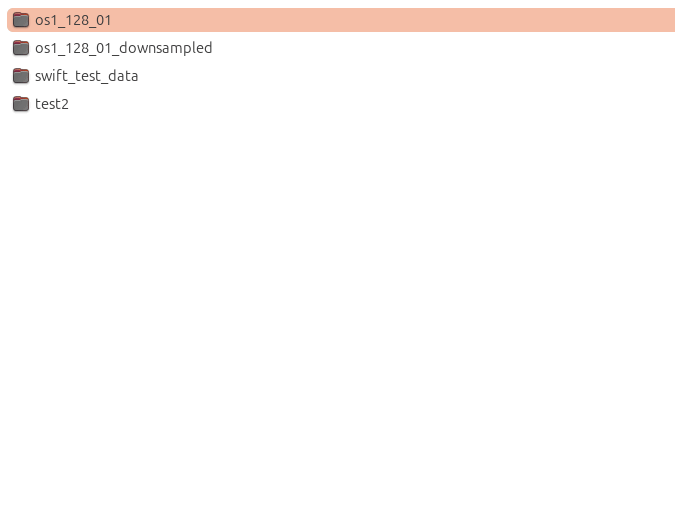

# Nautilus ROS2 Bag Info Extension

A Nautilus file manager extension that displays ROS2 bag metadata in context menu submenus for quick inspection without opening external tools.

No dependencies on ROS2 runtime environment.



## Requirements

- **Nautilus** file manager (GNOME Files)
- **nautilus-python** extension support
- **Python 3** with PyYAML
  
Install dependencies:
   ```bash
   sudo apt install nautilus-python python3-yaml
   ```

## Installation
```bash
git clone https://github.com/yourusername/nautilus-ros2-bag-info.git
cd nautilus-ros2-bag-info
chmod +x install.sh
./install.sh
```

## Usage

1. Navigate to a directory containing ROS2 bag files
2. Right-click on any ROS2 bag directory
3. Select **"ROS2 Bag Info"** from the context menu
4. Explore the metadata in the submenu

### Supported Bag Types

The extension detects ROS2 bags that have:
- metadata.yaml file
- At least one .mcap or .db3 file

This might be extended to also support ROS1 bags in the future.

## Troubleshooting

### Extension not showing up?
```bash
# Check if nautilus-python is working
python3 -c "import gi; gi.require_version('Nautilus', '4.0')"

# Restart nautilus completely
killall nautilus
nautilus &
```

This extension has been tested with:
- Ubuntu 24.04 LTS
- Nautilus 46.x (GNOME Files)
- GTK 4.0
- Python 3.12
- nautilus-python 4.0